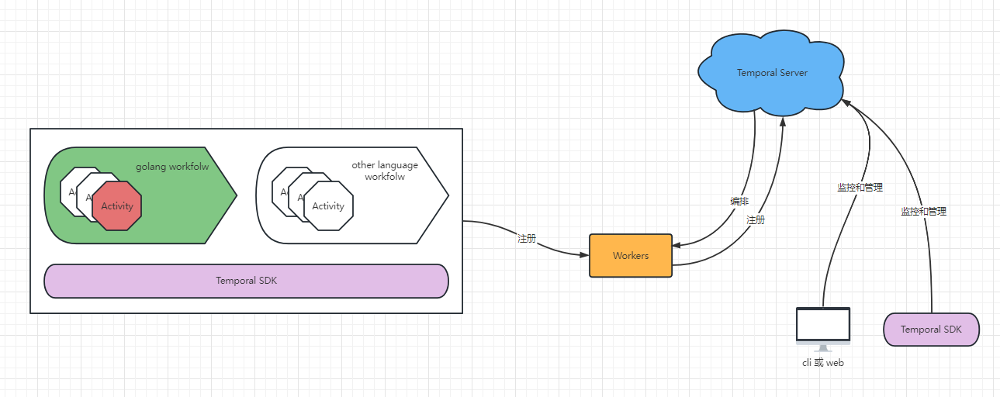

# 分布式任务调度框架Temporal

github：https://github.com/temporalio/temporal


Temporal为golang编写的 分布式任务调度框架 ，定位是`microservice orchestration platform`，提供工作流编排、C\S架构、状态查询等一系列功能



Activity：使用Temporal提供的各种语言的SDK（go、java、python、php等等）编写的代码逻辑
Workflow：Activity集合，多个Activity构成一个Workflow，是调度的最小单位
Workers：不同语言写的Workflow可以注册到对应语言的Workers中，Workers是代码的真正执行者
Temporal Server：管理注册到自己的Workers，向Workers下发任务，监听任务状态等
cli、web、SDK：任务的发起者、监控任务进度等
cli、web：负责任务的监控、查询等

>     【生产者】----------------->【调度】-----------------> 【消费者】  
>   cli、web、SDK----------------->Temporal Server----------------->Workers


------


### 示例

模拟场景是：延时1小时向用户发送短信和邮件

1. 编写`Activity`代码

  ```go
  type MessageRequest struct {
     PhoneNum string
     Content  string
     Tags     []string
  }
  
  func SendMessage(ctx context.Context, mr MessageRequest) (mresp MessageResponse, error) {
     fmt.Printf(
        "\nSending message to %s \n Content is %s \n ",
        mr.PhoneNum,
        mr.Content,
     )
     return nil, nil
  }
  
  type EmailRequest struct{
      From string 
      To string 
      Content stirng 
  }
  
  func SendEmail(ctx context.Context, er EmailRequest) error{
         fmt.Printf(
        "\nSending email to %s \n Content is %s \n ",
        er.To,
        er.Content,
     )
     return nil, nil
  }
  ```

  Activity代码的限制很少，什么样的函数都可以成为Activity，甚至结构体上的方法也可以

  

2. 编写`Workflow`代码

   ```go
   func SendMessageWorkflow(ctx workflow.Context, msq MessageRequest, er EmailRequest) error {
      options := workflow.ActivityOptions{
         StartToCloseTimeout: time.Minute,
      }
      ctx = workflow.WithActivityOptions(ctx, options)
      
      //工作流
      //1. 先执行SendMessage
      err := workflow.ExecuteActivity(ctx, SendMessage, msq).Get(ctx, nil)
      if err != nil {
         return err
      }
      //2. 再执行SendEmail
      err = workflow.ExecuteActivity(ctx, SendEmail, msq).Get(ctx, nil)
      if err != nil {
         return err
   }
   return nil
}
```

其实Workflow也是一段函数，但是Workflow里的代码有些限制，比如不能和外部系统交互（读写文件、访问网络）等，所以需要划分Activity的原因就是Activity没有这种限制


3. 启动 Workers

   ```
   func main() {
       //连接到Temporal Server进行注册
      c, err := client.NewClient(client.Options{})
      if err != nil {
         log.Fatalln("unable to create Temporal client", err)
      }
      defer c.Close()
      
      w := worker.New(c, app.TaskQueue, worker.Options{})
      w.RegisterWorkflow(app.SendMessageWorkflow)
      w.RegisterActivity(app.SendMessage)
      w.RegisterActivity(app.SendEmail)
      
      //Start listening to the Task Queue
      err = w.Run(worker.InterruptCh())
      if err != nil {
      log.Fatalln("unable to start Worker", err)
   }
}
```

启动一个Worker，将自身注册到Temporal Server，再把Workflow和Activity注册到它内部，这个Worker就成功启动了。如果结合K8s，还能编排不同的Worker，比如：给Worker扩缩容，监控Worker等


4. 启动`Template Server`
  根据官方github文档，使用docker启动服务，且可以配合`Temporal Web UI `使用

  

5. 发起任务

  ```go
  func main() {
     //连上Template Server
     c, err := client.NewClient(client.Options{})
     if err != nil {
        log.Fatalln("unable to create Temporal client", err)
     }
     defer c.Close()
     
     options := client.StartWorkflowOptions{
        TaskQueue: app.TaskQueue,
     }
     r1 := app.MessageRequest{
        ...
     }
     r2 := app.EmailRequest{
        ...
     }
     we, err := c.ExecuteWorkflow(context.Background(), options, "SendMessageWorkflow", transferDetails)
     if err != nil {
        log.Fatalln("error starting SendMessageWorkflow", err)
     }
     fmt.Println(we.GetID(), we.GetRunID())
  }
  ```

  最后使用SDK提供的方法启动Workflow，TaskQueue用于路由到Workers，再提供Workflow的函数名，就可以调用成功了


